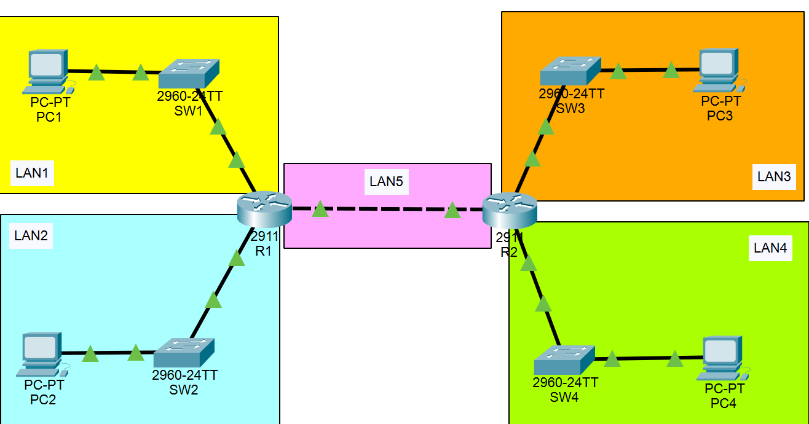

# TD subnetting 

 - *Consulter* l'enoncé `subnetting.pdf` 
 - *Réaliser* l'exercice 1 sur feuille
 - *Réaliser* l'exercice 2 sur PC (fichier de simulation subnetting-cisco-packet-tracer.pkt).
 - [Lien de télèchargement CISCO PACKET TRACER 8.2.2](https://drive.google.com/file/d/1-iHblRkJ6OvOC7pO5D_IUDhekEqS5X6Q/view?usp=sharing)

